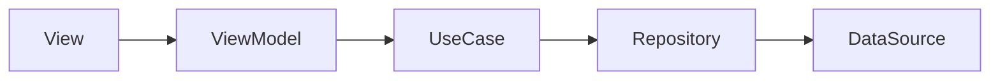
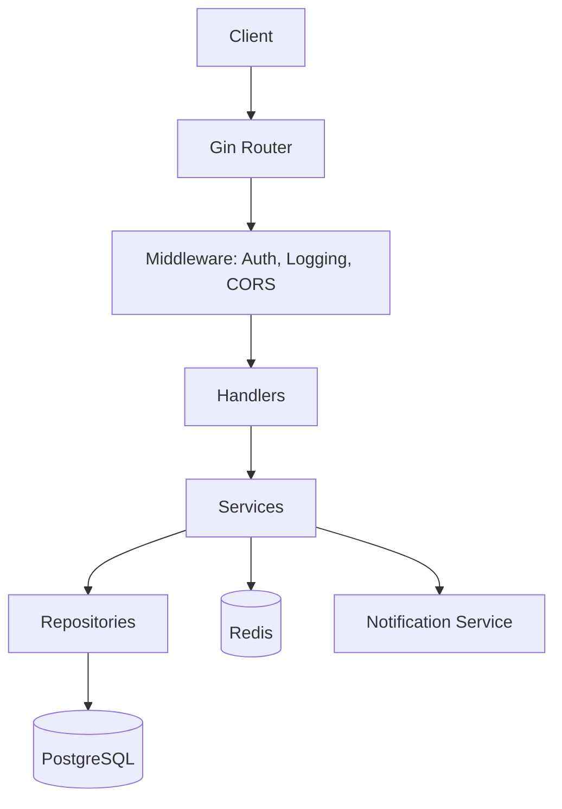
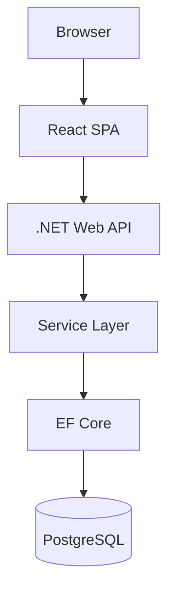

# Architecture Overview

## System Design Philosophy

All POC projects follow these core principles:

### 1. Clean Architecture (Layered)
```
┌─────────────────────────────────────┐
│           Presentation              │  (UI / Controllers)
├─────────────────────────────────────┤
│           Application               │  (Use Cases / Services)
├─────────────────────────────────────┤
│             Domain                  │  (Entities / Business Rules)
├─────────────────────────────────────┤
│          Infrastructure             │  (DB / External APIs / Cache)
└─────────────────────────────────────┘
```

### 2. Dependency Rule
- Inner layers never depend on outer layers
- Dependencies point inward
- Interfaces define contracts at boundaries

### 3. MVVM for Mobile / Frontend


## Per-Project Architecture

### Project 2: Currency Rate Alert API (Go)


### Project 4: Warehouse Dashboard (.NET + React)


## Cross-Cutting Concerns

| Concern | Approach |
|---------|----------|
| Authentication | JWT tokens (stateless) |
| Logging | Structured JSON (serilog/.NET, zap/Go) |
| Error Handling | Standardized error envelope |
| Validation | Input validation at handler/controller level |
| Health Checks | `/health` + `/ready` endpoints |
