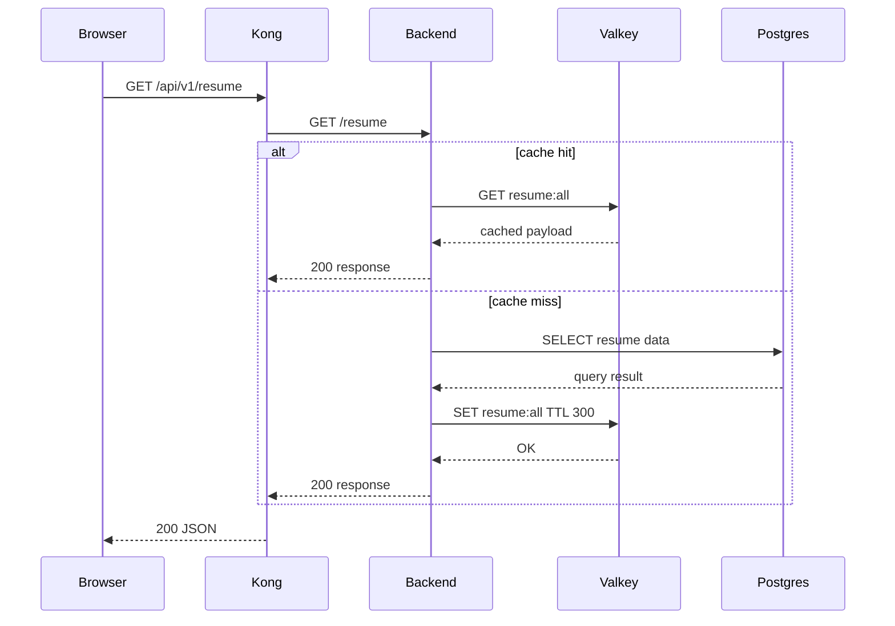

# Sequence Diagrams

```mermaid
sequenceDiagram
    participant Browser
    participant Kong
    participant Backend
    participant Valkey
    participant Postgres

    Browser->>Kong: GET /api/v1/resume
    Kong->>Backend: GET /resume
    alt cache hit
        Backend->>Valkey: GET resume:all
        Valkey-->>Backend: cached payload
        Backend-->>Kong: 200 response
    else cache miss
        Backend->>Postgres: SELECT resume data
        Postgres-->>Backend: query result
        Backend->>Valkey: SET resume:all TTL 300
        Valkey-->>Backend: OK
        Backend-->>Kong: 200 response
    end
    Kong-->>Browser: 200 JSON
```
